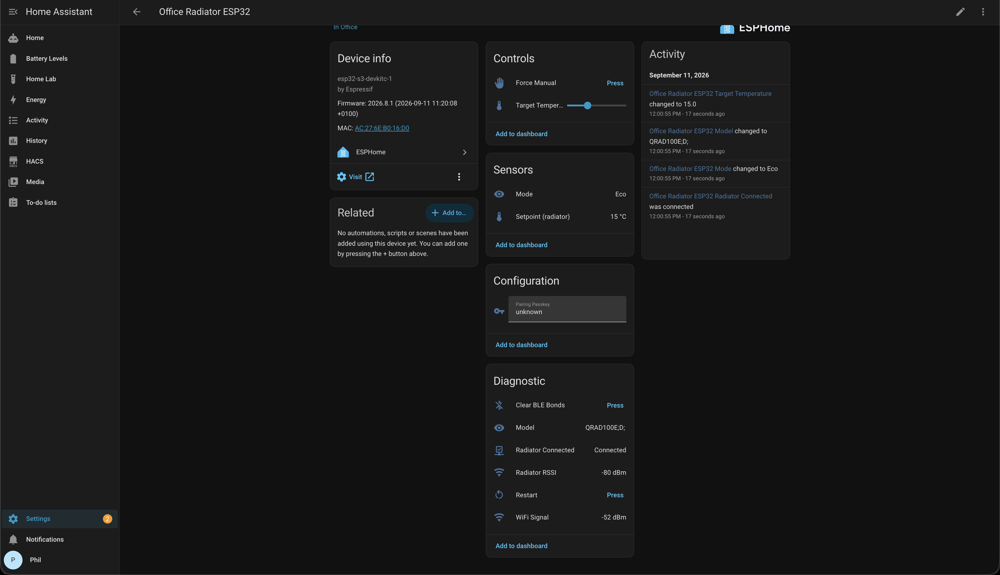

# Dimplex Q-Rad "smart" bridge

Dimplex sell the Q-Rad as a smart radiator. What that means in practice is a £40 plug-in radio module per radiator, a £100 hub, an account, and an app that talks to the radiator via Microsoft Azure. No local API, no Home Assistant, and if the internet goes down so does your heating control.

It turns out the radiator has a Bluetooth radio on its control board already, the spec sheet calls it "Bluetooth for software updates", and it will happily take a setpoint from anything that pairs with it. So each of mine now has a £6 ESP32 sitting nearby running [ESPHome](https://esphome.io/), and Home Assistant sets the temperature directly. Nothing from Dimplex's smart range was bought.



Everything on that page is read back from the radiator, so if someone turns it up on the buttons, Home Assistant knows within thirty seconds.

This was worked out on a QRAD100E Series D, standing on [JYewman's work](https://github.com/JYewman/Sunhouse-Dimplex-Storage-Heater-ESPHome-Home-Assistant) reversing the same Glen Dimplex BLE service on a Sunhouse storage heater; see [Credits](#credits). The E-series family (QRAD050E to QRAD200E) shares the controller, so other GDHV heaters with a **Comms** menu are worth trying.

## Hardware

| Part | Notes |
|---|---|
| Dimplex Q-Rad E, Series D | Any QRADxxxE with a **Comms** entry under Settings. The RF variants (QRADxxxRF) are untested |
| [Waveshare ESP32-S3-Zero](https://www.waveshare.com/wiki/ESP32-S3-Zero) | One per radiator. ESP32-S3FH4R2, 4 MB flash, 2 MB PSRAM, USB-C, onboard WS2812. Any ESP32-S3 will do, but the cheap Super Mini clones have a notoriously bad antenna and this device is nothing but radio |
| USB-C power supply | Anything 1 A. Idle draw is well under 100 mA |

There is no wiring. The board talks to the radiator over the air and the only pin in use is the onboard LED. Put it anywhere in the same room; the node reports link RSSI so you can check the spot.

## How it works

Enable Bluetooth on the radiator under Menu > Settings > Comms. It then advertises as `AL9502<Dimplex>` and pairs with a six-digit passkey shown on its own screen, standard BLE, no cloud involved. The setting, the advertising and the bond all survive a power cut, so once a node is paired it reconnects on its own after any outage, on either side.

The radiator's modes are simpler than the menus suggest. Manual and Eco are one mode: 19 °C and below the display says Eco, 20 and above it says Manual, and the setpoint is the only thing that changes. So "set this room to N degrees" is a single characteristic write. The node also guards against the radiator having been put into Timer or Frost Protect on its buttons, forcing Manual first so a write sticks instead of temporarily editing a timer period.

Timers, boost, advance, away, clock and even the backlight colour are all exposed over BLE and decoded in [docs/ble-protocol.md](docs/ble-protocol.md), but not built. I only use Manual. The characteristic numbers and the pairing approach came from the Sunhouse project; the Q-Rad's mode codes, the Manual/Eco relationship, boost, away and the write formats were decoded here, and differ from the Sunhouse in places.

The one thing the radiator won't give up is its room temperature. It isn't in any readable characteristic, there's no notify path, and opening the radiator's own debug screen changes nothing on the air. It most likely needs a request-then-read sequence known to Dimplex's ConfigR installer app. I have a sensor in every room already, so it sits on the [backlog](docs/backlog.md).

## Firmware

The shared package is [`esphome/qrad-common.yaml`](esphome/qrad-common.yaml). Each radiator is a three-line file like [`esphome/qrad-office.yaml`](esphome/qrad-office.yaml) giving it a name and the radiator's BLE MAC. Copy [`esphome/secrets.yaml.example`](esphome/secrets.yaml.example) to `secrets.yaml`, fill in Wi-Fi (it's gitignored), then from the repo root:

```
mise install && mise run deps                                                 # once: Python, ESPHome, bleak in .venv
mise run esphome-run esphome/qrad-office.yaml --device /dev/cu.usbmodem1101   # first flash, over USB
mise run esphome-run esphome/qrad-office.yaml --device qrad-office.local      # after that, over the air
mise run esphome-logs esphome/qrad-office.yaml --device qrad-office.local     # watch it
```

Bring-up per radiator is: flash with the MAC as zeros, read the MAC the node logs when it sees the radiator, flash again, then type the passkey from the radiator's screen into the **Pairing Passkey** entity. About ten minutes. Details in [esphome/README.md](esphome/README.md).

What the node does:

- Connects to the radiator, asks for an encrypted link, bonds on first pairing and reconnects on its own thereafter.
- Exposes **Target Temperature**, 7 to 30 °C in whole degrees. It's non-optimistic: the value is what the radiator reports, polled every 30 s and re-read a second after every write, and it goes unavailable when the radiator is off.
- Exposes **Mode**, **Setpoint (radiator)**, **Radiator Connected**, **Radiator RSSI** and **Model**, plus **Force Manual**, **Clear BLE Bonds** and **Restart** buttons.
- Serves a web page at `http://<name>.local/` so a radiator can be paired and driven without Home Assistant.
- Uses the onboard LED as the only status indicator:

| LED | Meaning |
|---|---|
| Green | Talking to the radiator over an encrypted link |
| Amber | Not connected: searching, radiator off, or waiting for a passkey |

On placement: better than -75 dBm RSSI is solid, -75 to -85 works with the odd retry, worse than -85 will drop. Three metres away in the same room measured -71 to -79. The radiator's antenna is behind the plastic control panel, so favour that end over the steel back.

## Home Assistant

The node is discovered by the ESPHome integration and asks for the API key from `secrets.yaml`. A minimal card, with whatever entity ids Home Assistant gave your device:

```yaml
type: entities
title: Office Radiator
state_color: true
entities:
  - entity: number.office_radiator_target_temperature
    name: Target
  - entity: sensor.office_radiator_setpoint_radiator
    name: Radiator says
  - entity: text_sensor.office_radiator_mode
    name: Mode
  - entity: binary_sensor.office_radiator_radiator_connected
    name: Link
```

For a proper thermostat card, wrap the number in a `generic_thermostat` climate using the room's own temperature sensor, or drive the number from automations. Radiator Connected going off is the "someone switched it off at the wall" signal.

## Protocol

Glen Dimplex's BLE service is `00000000-0000-1000-8000-00805f9b34fb`, with characteristics `0000XXXX-0000-1000-8000-00805f9b34fb`. Passkey-display pairing, one central at a time. What this project uses:

| Characteristic | Read | Write |
|---|---|---|
| `1023` | Setpoint, LE16 whole degrees | `[temp, 0x00]` |
| `1001` | Mode: byte 0 is 1 Timer, 2 Manual, 3 Eco, 4 Frost; byte 1 the timer sub-mode; byte 3 set while boosting | `[mode, submode, 0, 0, 0, 0]` |
| `2005` (service `…-0003-…`) | Model string, e.g. `QRAD100E;D;` | |

Also decoded from watching the radiator while pressing its buttons: clock (`0006`), boost countdown (`1027`) and default temperature (`1028`), advance (`100d`), away with its end time (`102a`), setpoint range (`1006`), backlight colour (`0001`), which menu screen is showing (`0007`), and the schedule buffer (`1002`). The full table, with each characteristic marked confirmed, inferred or unknown, and the raw capture sessions, is in [docs/ble-protocol.md](docs/ble-protocol.md). Two Cypress OTA bootloader services are also present. Leave those alone.

[`tools/`](tools/) has the bleak scripts this was reversed with, from a Mac: dump the GATT table, print any characteristic that changes while you press buttons, and write tests that put things back afterwards. `mise tasks` lists them.

## The road not taken

[docs/research.md](docs/research.md) covers what Dimplex Control actually is: an 868 MHz 6LoWPAN mesh with AES-128, keys in a secure element on the hub, and a round trip through Azure for every command. Emulating the hub would have meant reimplementing that stack with no way to capture a join. Plan B was the radio module's slot on the radiator, which is a plaintext serial link. Bluetooth made both unnecessary.

## Credits

- [JYewman/Sunhouse-Dimplex-Storage-Heater-ESPHome-Home-Assistant](https://github.com/JYewman/Sunhouse-Dimplex-Storage-Heater-ESPHome-Home-Assistant) reversed the Glen Dimplex BLE service from the Dimplex Remo app for a Sunhouse SSHE storage heater. The service UUID, the characteristic numbers for mode, setpoint, range, advance, schedule and clock, the passkey-bonding approach and the shape of the ESPHome config all come from there. This project would have started from 55 anonymous characteristics without it.
- [bobthecooldad/Dimplex-Quantum-Storage-Heater-Dump](https://github.com/bobthecooldad/Dimplex-Quantum-Storage-Heater-Dump) published PCB photos of a Quantum UI board, which is how the Cypress PSoC BLE module was identified.
- [KRoperUK/dimplex-controller-py](https://github.com/KRoperUK/dimplex-controller-py) documents the Dimplex cloud API, which is what made the hub ecosystem understandable enough to rule out.
- Glen Dimplex's own spec sheets and help centre, listed in [docs/research.md](docs/research.md), for the 868 MHz, 6LoWPAN and AES-128 facts.

## Status

The office radiator is live in Home Assistant. Boards are on order for the other three. Open items in [docs/backlog.md](docs/backlog.md).
